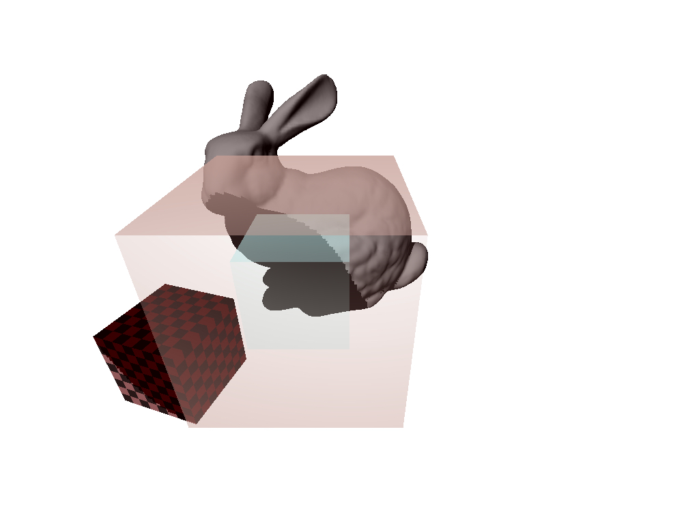

## 3DRasEngine



### Introduction
* 3DRasEngine is an offline rendering engine developed based on rasterization. 
* In order to emphasize the process of how a rendering engine works, 3DRasEngine is not optimized. 
* Most of the ideas behind the engine could be found on https://www.scratchapixel.com

### Features
* Just a simple rendering engine. No BS. 
* Supports Shadow and Alpha Blending. 

### Installation and Setup
```sh
git clone https://github.com/AlphaMistral/3DRasEngine.git
cd 3DRasEngine
make
make clean
./RasEngine
```
* After executing the above commands, the rendered results are stored at results/. 
* However currently the "makefile" in the RasEngine is ... as you can see, not created in a good way. You are more than welcomed to use "automake" yourself. This is to be revised in the future. 

### About Shadow.
* The Shadow Function in 3DRasEngine now supports only ONE SINGLE POINT LIGHT. 
* The implementation of Shadow is achieved by ShadowMapping. 
* However currently the GenerateShadowMap in the Renderer Class is extremely performance-sensitive and meanwhile it breaks the design of the architecture of the whole engine. Hence it needs to be revised. Anyway it is up and running and please feel free to give it a shot :)

### Trouble Shooting & Contact
* Obviously the Engine is suffering from some hard-coding. I am working on that, do not worry! 
* If you detect any unexpected output or error, or have any questions regarding any part of the engine, please feel free to contact me at:
* WeChat: yujingping95
* E-mail: Mistral@weymire.com 

### In the Future
* The 3DRasEngine will fully support ShadowMap. 
* More Shader Effects are to be added! 
* If you wanna see anything else, please raise up an issue :) 

